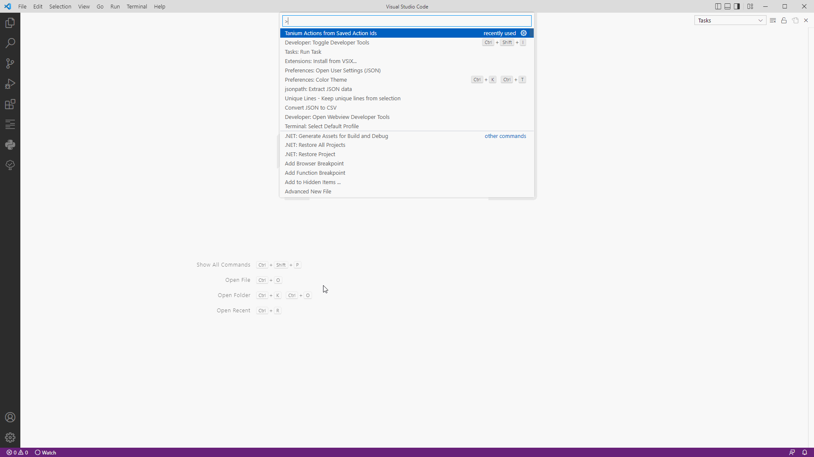

<h1>HoganSlender's Tanium Action Results from Saved Action</h1>

Contains commands to retrieve action results from every action created from a saved action.

- [Features](#features)
    - [Retrieve Action Results](#retrieve-action-results)
  - [Known Issues](#known-issues)
  - [Release Notes](#release-notes)

# Features

### Retrieve Action Results

This extension allows you to retrieve results from every action generted from a saved action in Tanium.

Execute command "Tanium Actions from Saved Action Ids"

## Known Issues
* none
## Release Notes
The extension will store the fqdn and username between calls.
